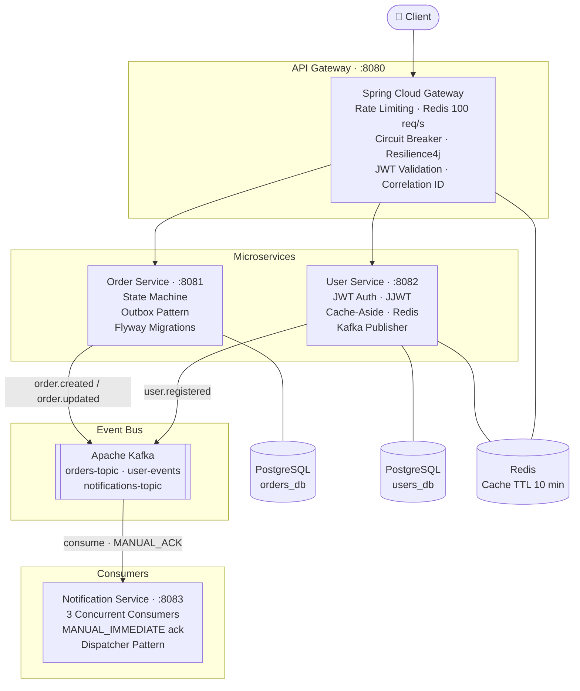

# Microservices Demo — Event-Driven Reference Implementation

[](https://www.java.com)
[](https://spring.io/projects/spring-boot)
[](https://kafka.apache.org)
[](https://www.docker.com)
[](https://www.postgresql.org)
[](https://redis.io)
[](https://github.com/cdgutierrez6/microservices-demo/actions/workflows/ci.yml)

---

<details open>
<summary><h2>🇺🇸 English</h2></summary>

Reference implementation and portfolio learning project that demonstrates event-driven microservices patterns — Outbox, Saga (choreography), Circuit Breaker, Cache-Aside, API Gateway — with generic `order`, `user`, and `notification` services on Spring Boot + Kafka. It is built for learning and demonstration, **not** a production deployment.

> **Status & Scope** — A self-contained learning / portfolio build that runs locally via Docker Compose. The services are illustrative (`order` / `user` / `notification`), not a real product; the repo does not run in production or at scale. The patterns are real and functional — the scale is not claimed.

---

### System Architecture



---

### Microservices

#### 1. `api-gateway` — Spring Cloud Gateway
- IP-based rate limiting with Redis (100 req/s)
- Circuit breaker per route with Resilience4j + fallback responses
- Centralized JWT validation before forwarding requests
- Correlation ID injection via `LoggingFilter` for distributed tracing

#### 2. `order-service` — Order Management
- Full order lifecycle: `PENDING → CONFIRMED → SHIPPED → DELIVERED`
- **Outbox Pattern** — order + outbox event saved in same transaction, relayed to Kafka via `@Scheduled` every 5 s
- Idempotent Kafka producer (`acks=all`, `retries=3`, `enable.idempotence=true`)
- Flyway migrations + ProblemDetail error responses (RFC 7807)

#### 3. `user-service` — User Management
- JWT authentication with JJWT (HMAC-SHA256)
- Redis Cache-Aside (10 min TTL) — miss populates cache, hit skips DB
- Kafka publisher on register/update events
- Flyway migrations

#### 4. `notification-service` — Notifications
- `@KafkaListener` consuming multiple topics with `MANUAL_IMMEDIATE` ack
- 3 concurrent consumers for throughput
- Dispatcher pattern for extensible notification routing

---

### Patterns Implemented

| Pattern | Description | Service |
|---|---|---|
| **Outbox Pattern** | At-least-once delivery via DB + scheduler relay | order-service |
| **Saga (Choreography)** | Distributed coordination via Kafka events | All |
| **Circuit Breaker** | Fault tolerance + fallback responses | api-gateway |
| **Cache-Aside** | Redis cache for frequent reads | user-service |
| **API Gateway** | Single entry point + cross-cutting concerns | api-gateway |
| **Correlation ID** | Distributed tracing across all services | api-gateway |

---

### Quick Start

#### Prerequisites
- Docker Desktop
- Java 17+
- Maven 3.9+

#### Start the full stack

```bash
git clone https://github.com/cdgutierrez6/microservices-demo.git
cd microservices-demo

# Start infrastructure first (Kafka needs ~20s to be ready)
docker-compose up -d kafka postgres-orders postgres-users redis zookeeper

# Then start all services
docker-compose up -d

# Verify all containers are healthy
docker-compose ps
```

#### Available Endpoints

```
POST http://localhost:8080/users/register  → Register user
POST http://localhost:8080/auth/login      → Get JWT token
GET  http://localhost:8080/users/{id}      → Get user (cached)
POST http://localhost:8080/orders          → Create order
GET  http://localhost:8080/orders/{id}     → Get order status
```

---

### Project Structure

```
microservices-demo/
├── api-gateway/
│   ├── src/main/java/com/cdgutierrez/gateway/
│   │   ├── config/           # Routes, CircuitBreaker, RateLimiter
│   │   ├── filter/           # LoggingFilter (Correlation ID)
│   │   └── controller/       # FallbackController
│   └── Dockerfile
├── order-service/
│   ├── src/main/java/com/cdgutierrez/orders/
│   │   ├── controller/       # OrderController (5 endpoints)
│   │   ├── service/          # OrderService (TX: order + outbox)
│   │   ├── repository/       # OrderRepository, OutboxRepository
│   │   ├── kafka/            # OrderEventProducer (@Scheduled relay)
│   │   ├── outbox/           # OutboxEvent entity
│   │   └── model/            # Order (state machine), OrderItem
│   ├── src/main/resources/db/migration/  # Flyway V1
│   └── Dockerfile
├── user-service/
│   ├── src/main/java/com/cdgutierrez/users/
│   │   ├── controller/       # UserController
│   │   ├── service/          # UserService (cache-aside + Kafka)
│   │   ├── security/         # JwtService (JJWT HMAC-SHA256)
│   │   └── model/            # User entity
│   └── Dockerfile
├── notification-service/
│   ├── src/main/java/com/cdgutierrez/notifications/
│   │   ├── consumer/         # OrderEventConsumer (MANUAL_IMMEDIATE ack)
│   │   ├── service/          # NotificationService (dispatcher)
│   │   └── config/           # KafkaConfig (3 concurrent consumers)
│   └── Dockerfile
├── docker-compose.yml
└── pom.xml                   # Parent POM — Spring Boot 3.3.4, Java 17
```

---

### Running Tests

```bash
# Run tests for all modules
mvn test

# Run tests for a specific service
mvn test -pl order-service
mvn test -pl user-service

# With JaCoCo coverage report
mvn verify

# Open coverage report (after mvn verify)
# target/site/jacoco/index.html

# Skip tests for faster builds
mvn package -DskipTests
```

| Service | Test focus | Tools |
|---|---|---|
| `order-service` | Order state machine, Outbox Pattern, Kafka producer | JUnit 5 + Mockito + Testcontainers |
| `user-service` | JWT generation/validation, Cache-Aside logic | JUnit 5 + Mockito |
| `api-gateway` | Route configuration, Circuit Breaker | Spring WebFlux Test |

**Example test:**

```java
@Test
void createOrder_WhenUserExists_ShouldPersistOrderAndOutboxEvent() {
    // Arrange
    var command = new CreateOrderRequest(userId, List.of(
        new OrderItemRequest("Product A", 2, new BigDecimal("49.99"))
    ));

    // Act
    var response = orderService.createOrder(command);

    // Assert
    assertThat(response.status()).isEqualTo(OrderStatus.PENDING);
    assertThat(outboxRepository.findByOrderId(response.id())).isPresent();
    // Both saved in same transaction — Outbox Pattern guaranteed
}
```

---

### Kafka Topics

| Topic | Partitions | Replication | Retention |
|---|---|---|---|
| `orders.created` | 3 | 1 | 7 days |
| `orders.updated` | 3 | 1 | 7 days |
| `user.registered` | 2 | 1 | 30 days |
| `notifications.pending` | 3 | 1 | 3 days |

---

### Technologies

- **Java 17** + **Spring Boot 3** + **Spring Cloud**
- **Apache Kafka** 3.x (event streaming)
- **PostgreSQL** 15 (persistence per service)
- **Redis** 7 (cache + rate limiting)
- **Docker** + **Docker Compose**
- **Resilience4j** (circuit breaker, retry)
- **JJWT** (stateless JWT authentication)
- **Flyway** (database migrations)
- **JUnit 5** + **Mockito** + **Testcontainers** (testing)

---

### Background

The patterns in this repository reflect production experience the author gained at **SATRACK** (2022–2025), building real-time vehicle-telemetry microservices in .NET and Java. That production system — and its scale — belongs to SATRACK; **this repository is an independent learning implementation of the same patterns**, not that system, and does not process production traffic.

---

### Author

**Cristian Daniel Gutiérrez S.** — Solutions Architect | Senior Java Engineer

[LinkedIn](https://www.linkedin.com/in/cristian-daniel-guti%C3%A9rrez-segura) · [Portfolio](https://portafolio-frontend-wheat.vercel.app) · [cdgutierrez6@gmail.com](mailto:cdgutierrez6@gmail.com)

</details>

---

<details>
<summary><h2>🇨🇴 Español</h2></summary>

Implementación de referencia y proyecto de aprendizaje / portafolio que demuestra patrones de microservicios orientados a eventos — Outbox, Saga (coreografía), Circuit Breaker, Cache-Aside, API Gateway — con servicios genéricos `order`, `user` y `notification` sobre Spring Boot + Kafka. Es para aprendizaje y demostración, **no** un despliegue en producción.

> **Estado y Alcance** — Un build de aprendizaje / portafolio autocontenido que corre localmente vía Docker Compose. Los servicios son ilustrativos (`order` / `user` / `notification`), no un producto real; el repo no corre en producción ni a escala. Los patrones son reales y funcionales — la escala no se reclama.

---

### Arquitectura del Sistema


---

### Microservicios

#### 1. `api-gateway` — Spring Cloud Gateway
- Rate limiting por IP con Redis (100 req/s)
- Circuit breaker por ruta con Resilience4j + respuestas fallback
- Validación JWT centralizada antes de reenviar requests
- Inyección de Correlation ID vía `LoggingFilter` para trazabilidad distribuida

#### 2. `order-service` — Gestión de Órdenes
- Ciclo de vida completo: `PENDING → CONFIRMED → SHIPPED → DELIVERED`
- **Outbox Pattern** — orden + evento outbox guardados en la misma transacción, retransmitidos a Kafka vía `@Scheduled` cada 5 s
- Productor Kafka idempotente (`acks=all`, `retries=3`, `enable.idempotence=true`)
- Migraciones Flyway + respuestas de error ProblemDetail (RFC 7807)

#### 3. `user-service` — Gestión de Usuarios
- Autenticación JWT con JJWT (HMAC-SHA256)
- Cache-Aside Redis (TTL 10 min) — miss llena caché, hit evita consulta a BD
- Publicador Kafka en eventos de registro/actualización
- Migraciones Flyway

#### 4. `notification-service` — Notificaciones
- `@KafkaListener` consumiendo múltiples topics con ack `MANUAL_IMMEDIATE`
- 3 consumers concurrentes para mayor throughput
- Patrón Dispatcher para routing de notificaciones extensible

---

### Patrones Implementados

| Patrón | Descripción | Servicio |
|---|---|---|
| **Outbox Pattern** | Entrega at-least-once vía BD + relay programado | order-service |
| **Saga (Choreography)** | Coordinación distribuida vía eventos Kafka | Todos |
| **Circuit Breaker** | Tolerancia a fallos + respuestas fallback | api-gateway |
| **Cache-Aside** | Cache Redis para lecturas frecuentes | user-service |
| **API Gateway** | Punto de entrada único + cross-cutting | api-gateway |
| **Correlation ID** | Trazabilidad distribuida entre todos los servicios | api-gateway |

---

### Inicio Rápido

#### Prerrequisitos
- Docker Desktop
- Java 17+
- Maven 3.9+

#### Levantar todo el stack

```bash
git clone https://github.com/cdgutierrez6/microservices-demo.git
cd microservices-demo

# Levantar infraestructura primero (Kafka necesita ~20s)
docker-compose up -d kafka postgres-orders postgres-users redis zookeeper

# Luego levantar todos los servicios
docker-compose up -d

# Verificar que todos los containers estén saludables
docker-compose ps
```

#### Endpoints disponibles

```
POST http://localhost:8080/users/register  → Registrar usuario
POST http://localhost:8080/auth/login      → Obtener JWT
GET  http://localhost:8080/users/{id}      → Obtener usuario (cacheado)
POST http://localhost:8080/orders          → Crear orden
GET  http://localhost:8080/orders/{id}     → Ver estado de orden
```

---

### Estructura del Proyecto

```
microservices-demo/
├── api-gateway/
│   ├── src/main/java/com/cdgutierrez/gateway/
│   │   ├── config/           # Rutas, CircuitBreaker, RateLimiter
│   │   ├── filter/           # LoggingFilter (Correlation ID)
│   │   └── controller/       # FallbackController
│   └── Dockerfile
├── order-service/
│   ├── src/main/java/com/cdgutierrez/orders/
│   │   ├── controller/       # OrderController (5 endpoints)
│   │   ├── service/          # OrderService (TX: orden + outbox)
│   │   ├── kafka/            # OrderEventProducer (@Scheduled relay)
│   │   ├── outbox/           # OutboxEvent entity
│   │   └── model/            # Order (máquina de estados), OrderItem
│   └── Dockerfile
├── user-service/
│   ├── src/main/java/com/cdgutierrez/users/
│   │   ├── service/          # UserService (cache-aside + Kafka)
│   │   ├── security/         # JwtService (JJWT HMAC-SHA256)
│   └── Dockerfile
├── notification-service/
│   ├── src/main/java/com/cdgutierrez/notifications/
│   │   ├── consumer/         # OrderEventConsumer (ack MANUAL_IMMEDIATE)
│   │   ├── service/          # NotificationService (dispatcher)
│   │   └── config/           # KafkaConfig (3 consumers concurrentes)
│   └── Dockerfile
├── docker-compose.yml
└── pom.xml                   # POM padre — Spring Boot 3.3.4, Java 17
```

---

### Correr Tests

```bash
# Correr tests de todos los módulos
mvn test

# Correr tests de un servicio específico
mvn test -pl order-service
mvn test -pl user-service

# Con reporte de cobertura JaCoCo
mvn verify

# Abrir reporte de cobertura (después de mvn verify)
# target/site/jacoco/index.html

# Omitir tests para builds más rápidos
mvn package -DskipTests
```

| Servicio | Foco de tests | Herramientas |
|---|---|---|
| `order-service` | Máquina de estados, Outbox Pattern, productor Kafka | JUnit 5 + Mockito + Testcontainers |
| `user-service` | Generación/validación JWT, lógica Cache-Aside | JUnit 5 + Mockito |
| `api-gateway` | Configuración de rutas, Circuit Breaker | Spring WebFlux Test |

**Ejemplo de test:**

```java
@Test
void createOrder_WhenUserExists_ShouldPersistOrderAndOutboxEvent() {
    // Arrange
    var command = new CreateOrderRequest(userId, List.of(
        new OrderItemRequest("Producto A", 2, new BigDecimal("49.99"))
    ));

    // Act
    var response = orderService.createOrder(command);

    // Assert
    assertThat(response.status()).isEqualTo(OrderStatus.PENDING);
    assertThat(outboxRepository.findByOrderId(response.id())).isPresent();
    // Ambos guardados en la misma transacción — garantía del Outbox Pattern
}
```

---

### Temas Kafka

| Topic | Particiones | Replication | Retención |
|---|---|---|---|
| `orders.created` | 3 | 1 | 7 días |
| `orders.updated` | 3 | 1 | 7 días |
| `user.registered` | 2 | 1 | 30 días |
| `notifications.pending` | 3 | 1 | 3 días |

---

### Tecnologías

- **Java 17** + **Spring Boot 3** + **Spring Cloud**
- **Apache Kafka** 3.x (event streaming)
- **PostgreSQL** 15 (persistencia por servicio)
- **Redis** 7 (cache + rate limiting)
- **Docker** + **Docker Compose**
- **Resilience4j** (circuit breaker, retry)
- **JJWT** (autenticación JWT stateless)
- **Flyway** (migraciones de base de datos)
- **JUnit 5** + **Mockito** + **Testcontainers** (testing)

---

### Contexto / Origen

Los patrones de este repositorio reflejan la experiencia de producción que el autor adquirió en **SATRACK** (2022–2025), construyendo microservicios de telemetría vehicular en tiempo real en .NET y Java. Ese sistema de producción — y su escala — pertenece a SATRACK; **este repositorio es una implementación de aprendizaje independiente de los mismos patrones**, no ese sistema, y no procesa tráfico de producción.

---

### Autor

**Cristian Daniel Gutiérrez S.** — Solutions Architect | Senior Java Engineer

[LinkedIn](https://www.linkedin.com/in/cristian-daniel-guti%C3%A9rrez-segura) · [Portfolio](https://portafolio-frontend-wheat.vercel.app) · [cdgutierrez6@gmail.com](mailto:cdgutierrez6@gmail.com)

</details>
